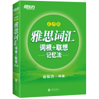

# 《雅思词汇》学习为期48天，今天是第11天

## 默写提示

[默写提示](ielts-silent-writing.html)，每天更新。

## 默写记录
    
坚持每天完成一句默写 [100个句子记完7000个雅思词汇](ielts100.html)，助力写作。

## 词根词缀学习

《雅思词汇》[词根&词缀学习](ielts-root.html).

## 题目分析

[上海交大2001年春季英语考博题](en/enlish2017.html)

## 新视野英语

[book1](new-horizon/book1.html)

